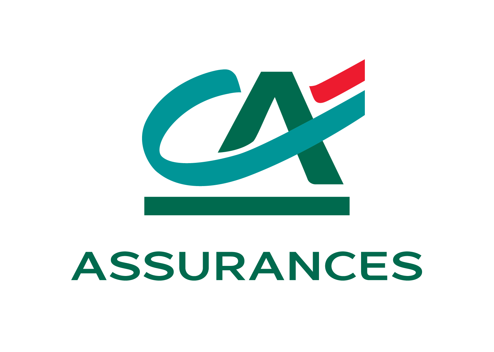

# Projects

## 2026

    

        
    

    

        <h3 class="publication-title">
            Asset Allocation Performance Forecasting
        </h3>
        
ENS Data Challenge & QRT

        
Predicting daily performance direction of asset allocations using liquidity and volatility data with LightGBM and Optuna.

        
2026

        

            Finance
            Machine Learning
        

    

## 2025

    

        
    

    

        <h3 class="publication-title">
            InsurPrime: Agricultural Risk Modeling
        </h3>
        
ENS Data Challenge & Crédit Agricole Assurances

        
Hybrid architecture (Poisson/Tweedie) for claim frequency and cost estimation using CatBoost stacking.

        
2025

        

            Data Challenge
            CatBoost
        

    

    

        
    

    

        <h3 class="publication-title">
            Multi-Label Emotion Classifier
        </h3>
        
PyTorch Project

        
Built a Transformer Encoder (BERT-like) from scratch including BPE Tokenizer and Multi-Head Attention for emotions in YouTube comments.

        
2025

        

            NLP
            Deep Learning
        

    

